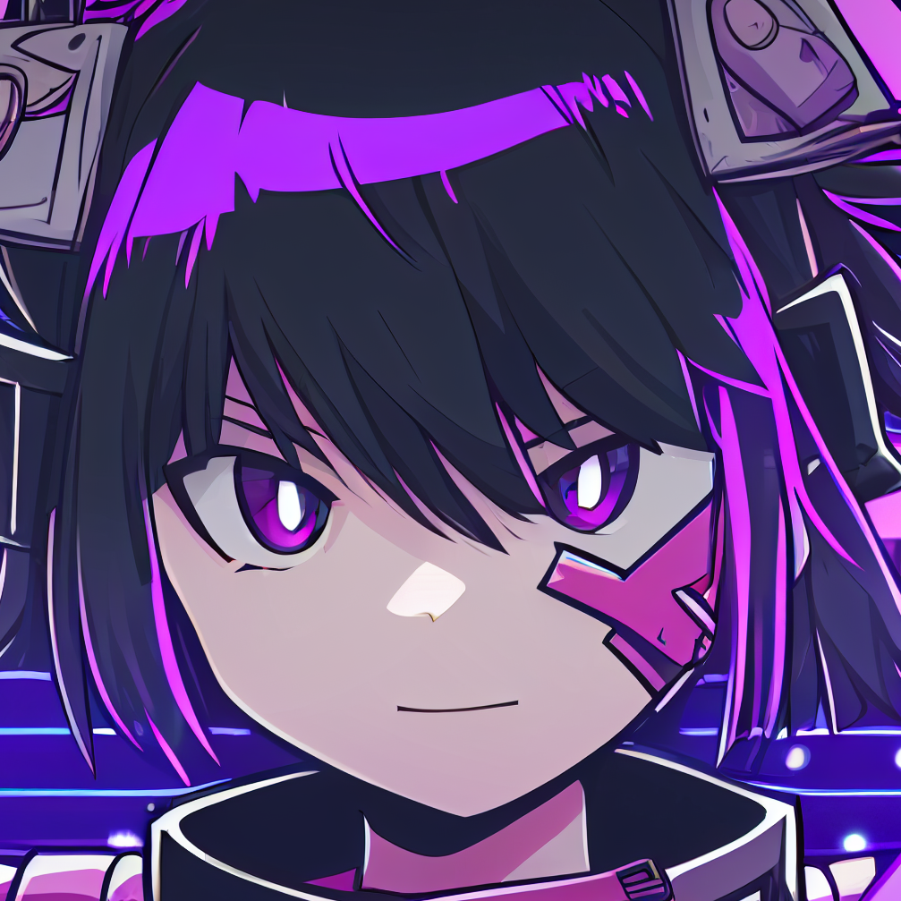

<h1>
    
    ez-discord.js
    
</h1>

> Discord applications finally made EZ (easy) ✨

# Progress

- [x] Repository setup
- [ ] Dynamic command handler based on file structure
  - [ ] Message event
    - [x] Global
    - [x] Guild
    - [ ] Direct message
  - [ ] Interaction events (slash commands)
    - [ ] "Simple" - Uses a webserver to handle interactions via POST requests from Discord
      - [ ] Global
      - [ ] Guild
    - [ ] "Advanced" - Uses a Discord bot to handle interactions via the Discord Gateway
      - [ ] Global
      - [ ] Guild
- [x] Basic bot example
